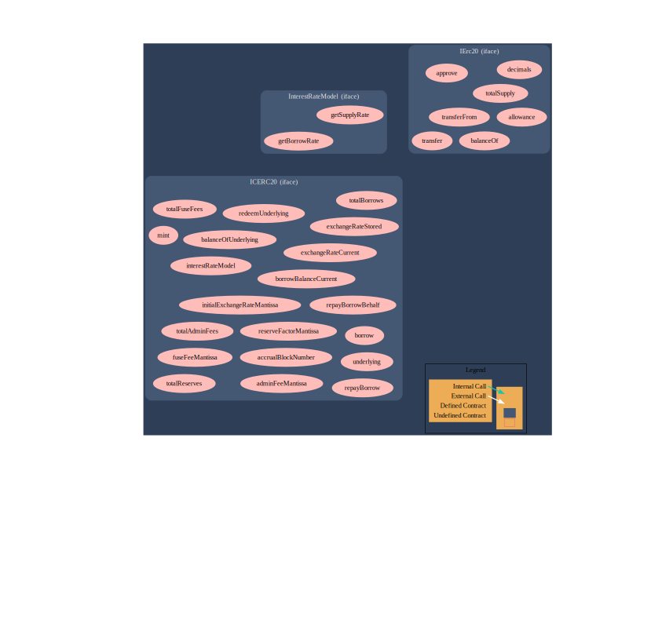

# Swivle_Audit

## Audit of Swivle

Below is a "Call Graph" of the Swivel Token. This call graph shows the `LibFuse.sol` file which has the `block.number` contained within it.

--------------------------------------------------

## Potential use of "block.number" as source of randonmness.

  * The environment variable `block.number` looks like it could be used as a source of randomness. The values of variables like coinbase, gaslimit, block number and timestamp are predictable and can be manipulated by a malicious miner. Also keep in mind that attackers know hashes of earlier blocks. Developers shouldnt use any of those environment variables as sources of randomness and should also be aware that the use of these variables introduces a certain level of trust into miners.

-----------------------------------------------------

## Weak Sources of Randomness from Chain Attributes [SWC-120](https://swcregistry.io/docs/SWC-120)

https://github.com/Keen-Sheen/Swivel_Audit/blob/5eb11ab79ac3bcbe1165d2fcbb6062e42d7ac5b7/2022-07-swivel/Tokens/LibFuse.sol#L19

https://github.com/Keen-Sheen/Swivel_Audit/blob/0ba71e0233714ff98fba5a152dafd6c0953c01b0/2022-07-swivel/Tokens/LibFuse.sol#L38

------------------------------------------------------

## Interfaces cannot inherit 

https://github.com/Keen-Sheen/Swivel_Audit/blob/dbf3c46aeca86fbdd337d8fa7ca8cd62fe9115fc/2022-07-swivel/Tokens/Interfaces.sol#L35

## Prevention 

* Using commitment scheme, e.g. RANDAO.

* Using external sources of randomness via oracles, e.g. Oraclize. Note that this approach requires trusting in oracle, thus it may be reasonable to use multiple oracles.

* Using Bitcoin block hashes, as they are more expensive to mine.
